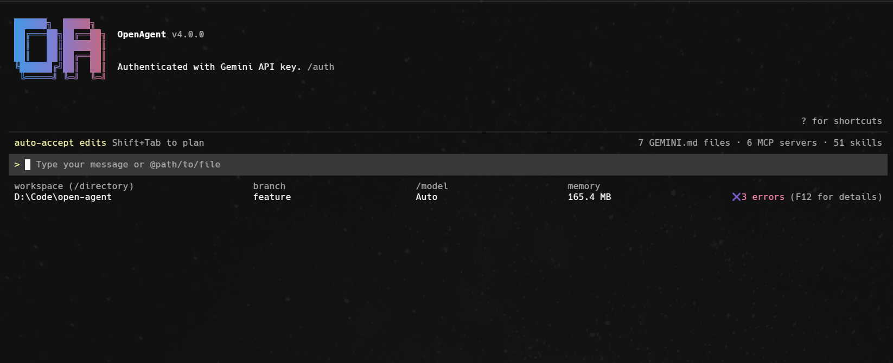

### **Support Project:**

<a href="https://www.buymeacoffee.com/haseebheaven">
    
</a>
<a href="https://ko-fi.com/heavenhm">
    
</a>

# OpenAgent — Open-Source Agent for Your Terminal

> Describe a task in plain English. OpenAgent plans, uses tools, and delivers —
> with free, local, and BYOK cloud models. No account required.

### Main UI



```bash
npm install && npm run build
npm start -- --free "analyze sales.csv and plot top 10 customers"
```

**Free** OpenRouter models · **local** Ollama / LM Studio · **Windows / Mac / Linux** · no vendor lock-in

## Install

Node.js 20+. Latest multi-provider work is on **`feature`**:

```bash
git clone --branch feature https://github.com/haseeb-heaven/open-agent.git
cd open-agent
npm install && npm run build
npm start
```

## Quick start

```bash
npm start                              # local-first (Ollama if running)
npm start -- --free "analyze this CSV" # free/cheap catalog + auto-fallback
npm start -- --models                  # list models by provider
npm start -- --byok                    # interactive keys → .env
npm start -- -m openrouter-free
npm start -- -m ollama/llama3.1:8b
npm start -- --provider groq -m llama-3.1-8b-instant
```

In-session: `/models`, `/byok [provider key]`, `/websearch`.

## API keys

Local (Ollama, LM Studio): **no key**. Cloud: one env var per provider — copy
[`.env.example`](.env.example) → `.env`, or use `--byok` / `/byok`.

| Provider | Env |
| -------- | --- |
| OpenAI | `OPENAI_API_KEY` |
| Anthropic | `ANTHROPIC_API_KEY` |
| Gemini | `GEMINI_API_KEY` |
| Groq | `GROQ_API_KEY` |
| DeepSeek | `DEEPSEEK_API_KEY` |
| NVIDIA | `NVIDIA_API_KEY` |
| Together | `TOGETHER_API_KEY` |
| HuggingFace | `HF_TOKEN` |
| OpenRouter | `OPENROUTER_API_KEY` |
| Cerebras | `CEREBRAS_API_KEY` |
| Z.ai | `Z_AI_API_KEY` |

## Web search

`google_web_search` auto-picks a backend from available keys (you do **not** need all of them). Fallback without keys: **DuckDuckGo**.

| Model family | Best backend |
| ------------ | ------------ |
| Gemini | Google grounding (`GEMINI_API_KEY`) |
| Open-source / free | **Brave** (`BRAVE_API_KEY`) |
| Local | DuckDuckGo (no key) |

Also: Tavily, Serper, Exa. Force with `WEB_SEARCH_PROVIDER=brave` (or `tavily` / `serper` / `exa` / `gemini` / `duckduckgo`).

| Backend | Env | Signup |
| ------- | --- | ------ |
| Brave | `BRAVE_API_KEY` | [keys](https://api.search.brave.com/app/keys) |
| Tavily | `TAVILY_API_KEY` | [app](https://app.tavily.com/home) |
| Serper | `SERPER_API_KEY` | [key](https://serper.dev/api-key) |
| Exa | `EXA_API_KEY` | [keys](https://dashboard.exa.ai/api-keys) |
| Gemini | `GEMINI_API_KEY` | [AI Studio](https://aistudio.google.com/apikey) |

```text
/websearch              # wizard (★ = recommended for current model)
/websearch list
/websearch open brave   # open signup if key empty
/websearch brave <key>  # save to .env
```

## Models

Registry: [`configs/models.toml`](configs/models.toml). Full matrix: [Models.MD](Models.MD).

| Flag | Effect |
| ---- | ------ |
| `--provider <id>` | `ollama`, `lmstudio`, `openai`, `anthropic`, `gemini`, `groq`, … |
| `-m, --model` | Registry key or `provider/model` |
| `--free` | Free/cheap rotation + fallback |
| `--models` | Print catalog and exit |
| `--byok` | Interactive key setup |
| `-y, --yolo` | Auto-approve tools (trusted workspaces only) |

## Docs

[docs/](docs/README.md) · [Quickstart](docs/get-started/index.md) · [Free models](docs/get-started/free-models.md) · [Local](docs/get-started/local-models.md) · [Providers](docs/get-started/providers.md) · [Errors](docs/resources/common-errors.md)

## Testing

From repo root. Vitest loads repo-root **`.env`** automatically (missing keys skip; live quota soft-skips).

```bash
npm test
# Unit — web search
npx vitest run src/websearch --root packages/core
# Unit — models / registry
npx vitest run src/providers --root packages/core
# Live — web search (.env keys)
npx vitest run src/websearch/live.websearch.test.ts --root packages/core
# Live — cloud models (bash)
RUN_LIVE_PROVIDER_TESTS=1 npx vitest run src/providers/cloud.integration.test.ts --root packages/core
# Live — local Ollama / LM Studio
RUN_LOCAL_PROVIDER_TESTS=1 npx vitest run src/providers/local.integration.test.ts --root packages/core
```

PowerShell live cloud:

```powershell
$env:RUN_LIVE_PROVIDER_TESTS = '1'
Remove-Item Env:CI -ErrorAction SilentlyContinue
npx vitest run src/providers/cloud.integration.test.ts --root packages/core
```

## Attribution

Based on [Gemini CLI](https://github.com/google-gemini/gemini-cli) (Google LLC, Apache-2.0). Modifications by Haseeb Mir (`open-agent` fork).

## License

Apache-2.0 — see [LICENSE](LICENSE).
