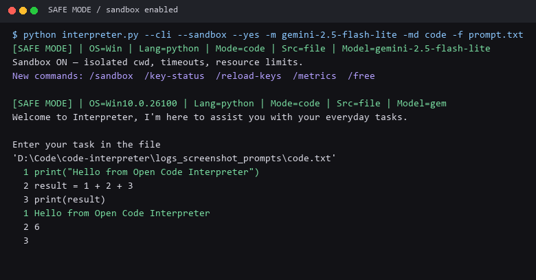
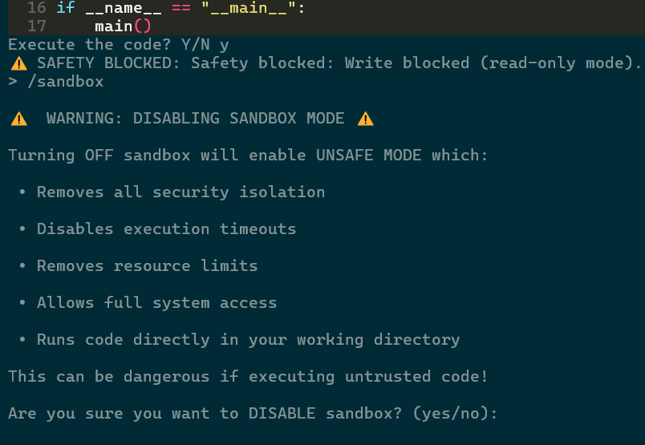

### **Hosting and Spaces:**
[](https://colab.research.google.com/drive/1jGg-NavH8t4W2UVs8MyVMv8bs49qggfA?usp=sharing)
[](https://replit.com/@HaseebMir/open-code-interpreter)
[](https://pypi.org/project/open-code-interpreter/)
[](https://github.com/haseeb-heaven/Open-Code-Interpreter/actions/workflows/python-app.yml)

### **Support Project:**
<a href="https://www.buymeacoffee.com/haseebheaven">
    
</a>
<a href="https://ko-fi.com/heavenhm">
    
</a>

**Welcome to Code-Interpreter 🎉,** an open-source tool that transforms natural language instructions into executable code using **OpenAI**, **Gemini**, **Groq**, **Claude**, **DeepSeek**, **NVIDIA**, **Z AI**, **Browser Use**, and **HuggingFace** models. It executes code safely and supports vision models for image processing.

Supports tasks like file operations, image editing, video processing, data analysis, and more. Works on Windows, MacOS, and Linux.

## **Why Unique?**

Committed to being **free** and **simple** - no downloads or tedious setups required. Works on Windows, Linux, macOS.

## **Table of Contents**
- [Features](#-features)
- [Installation](#-installation)
- [Usage](#-usage)
- [Examples](#-examples)
- [TUI Screenshots](#-tui-screenshots)
- [Settings](#-settings)
- [Contributing](#-contributing)
- [Versioning](#-versioning)
- [Changelog](#-changelog)
- [License](#-license)
- [Acknowledgments](#-acknowledgments)

## **Installation**

### Installation with Python package manager
To install Code-Interpreter, run the following command:

```bash
pip install open-code-interpreter
```

To run the interpreter with Python:

```bash
python interpreter.py -m 'z-ai-glm-5' -md 'code'
```

Make sure you install required packages before running the interpreter and have API keys setup in the `.env` file.

### Installation with Git
To get started with Code-Interpreter, follow these steps:

1. Clone the repository:

```bash
git clone https://github.com/haseeb-heaven/code-interpreter.git
cd code-interpreter
```

2. Install the required packages:

```bash
pip install -r requirements.txt
```

3. Copy the example environment file and add the keys you plan to use:

```bash
copy .env.example .env
```

## API Key setup for All models

Follow the steps below to obtain and set up the API keys for each service:

1. **Obtain the API keys:**
    - HuggingFace: Visit [HuggingFace Tokens](https://huggingface.co/settings/tokens) and get your Access Token.
    - Google Gemini: Visit [Google AI Studio](https://makersuite.google.com/app/apikey) and click on the **Create API Key** button.
    - OpenAI: Visit [OpenAI Dashboard](https://platform.openai.com/account/api-keys), sign up or log in, navigate to the API section in your account dashboard, and click on the **Create New Key** button.
    - Groq AI: Visit [Groq AI Console](https://console.groq.com/keys), sign up or log in, and click on the **Create API Key** button.
    - Anthropic AI: Visit [Anthropic AI Console](https://console.anthropic.com/settings/keys), sign up or log in, and click on the **Create Key** button.
    - NVIDIA API Catalog: Visit [NVIDIA Build](https://build.nvidia.com/), create a key, and use `NVIDIA_API_KEY`.
    - Z AI: Visit [Z AI Docs](https://docs.z.ai/) and use `Z_AI_API_KEY`.
    - OpenRouter: Visit [OpenRouter Keys](https://openrouter.ai/settings/keys) and use `OPENROUTER_API_KEY`.
    - Browser Use: Visit [Browser Use Docs](https://docs.browser-use.com/) and use `BROWSER_USE_API_KEY`.

2. **Save the API keys:**

Create a `.env` file in your project root directory and add the following lines:

```bash
export HUGGINGFACE_API_KEY="Your HuggingFace API Key"
export GEMINI_API_KEY="Your Google Gemini API Key"
export OPENAI_API_KEY="Your OpenAI API Key"
export GROQ_API_KEY="Your Groq API Key"
export ANTHROPIC_API_KEY="Your Anthropic API Key"
export DEEPSEEK_API_KEY="Your Deepseek API Key"
export NVIDIA_API_KEY="Your NVIDIA API Key"
export Z_AI_API_KEY="Your Z AI API Key"
export OPENROUTER_API_KEY="Your OpenRouter API Key"
export BROWSER_USE_API_KEY="Your Browser Use API Key"
```

## Offline models setup

This Interpreter supports offline models via **LM Studio** and **Ollama**. Follow the steps below:

- Download any model from [LM Studio](https://lmstudio.ai/) like _Phi-2, Code-Llama, Mistral_.
- In the app go to **Local Server** option and select the model.
- Start the server and copy the **URL** (LM-Studio will provide you with the URL).
- Run command `ollama serve` and copy the **URL** (Ollama will provide you with the URL).
- Open config file `configs/local-model.json` and paste the **URL** in the `api_base` field.
- Set the model name to `local-model` and run the interpreter.

```bash
python interpreter.py -md 'code' -m 'local-model'
```

## **Features**

- 🚀 Executes generated code from instructions
- 💾 Saves and edits code with advanced editor
- 📡 Supports offline models via LM Studio and Ollama
- 📜 Command history and mode selection
- 🧠 Multiple models and languages (Python/JavaScript)
- 👀 Code review before execution
- 🛡️ Safe sandbox execution with timeout and security
- 🔁 Self-repair for failed executions
- 💻 Cross-platform (Windows/macOS/Linux)
- 🤝 Integrates with HuggingFace, OpenAI, Gemini, Groq, Claude, DeepSeek, NVIDIA, Z AI, OpenRouter, Browser Use
- 🎯 Versatile tasks: file ops, image/video editing, data analysis

## **Safety Features**

### Mode Indicator
The interpreter displays the current safety mode in the session banner:
- **[SAFE MODE]** - Default mode with safety restrictions enabled (green)
- **[UNSAFE MODE ⚠️]** - Unrestricted mode (red with warning emoji)

### Dangerous Operation Handling
The interpreter handles dangerous operations with a single confirmation prompt:

**SAFE MODE:**
- Dangerous operations are **blocked entirely** (no confirmation prompt)
- You will see: `❌ Dangerous operation blocked in SAFE MODE.`
- No file deletion or modification operations are allowed

**UNSAFE MODE:**
- Single prompt for ALL operations (safe or dangerous)
- Safe operations: `Execute the code? (Y/N):`
- Dangerous operations: `⚠️ Dangerous operation. Continue? (Y/N):`
- Operations execute only if you confirm with `Y`

To enable unsafe mode:
```bash
python interpreter.py --unsafe
```

To enable safe mode:
```bash
python interpreter.py --sandbox
```

> **Warning:** Use unsafe mode with caution. Dangerous operations can delete or modify your files.

## 🛠️ **Usage**

To use Code-Interpreter, use the following command options:

- List of all **programming languages**:
    - `python` - Python programming language.
    - `javascript` - JavaScript programming language.

- List of all **modes**:
    - `code` - Generates code from your instructions.
    - `script` - Generates shell scripts from your instructions.
    - `command` - Generates single line commands from your instructions.
    - `vision` - Generates description of image or video.
    - `chat` - Chat with your files and data.

- See [Models.MD](Models.MD) for the complete list of supported models.

### Start TUI (default)
```bash
python interpreter.py
```

`python interpreter.py` opens the TUI and uses arrow-key navigation in a real terminal. The TUI falls back to plain text prompts when stdin is piped or not attached to a terminal.

### Open CLI mode
```bash
python interpreter.py --cli
```

`python interpreter.py --cli` automatically picks the best configured model from your `.env` file if you do not pass `-m`.

### Run with sandbox (safe)
```bash
python interpreter.py --tui --sandbox
```

### Run without sandbox (unsafe)
```bash
python interpreter.py --cli --no-sandbox
```

### Upgrade interpreter
```bash
python interpreter.py --upgrade
```

### Live CLI smoke validation (stable models only)
```bash
python scripts/validate_models_cli.py --providers gemini,groq --tier stable --mode chat
python scripts/validate_models_cli.py --providers openai,anthropic,deepseek,huggingface --tier stable --mode chat
python scripts/validate_models_cli.py --providers nvidia,z-ai,browser-use,openrouter --tier stable --mode chat
```

### Direct provider examples
```bash
python interpreter.py -m 'nvidia-nemotron' -md 'chat' -dc
python interpreter.py -m 'z-ai-glm-5' -md 'chat' -dc
python interpreter.py -m 'openrouter-free' -md 'chat' -dc
python interpreter.py -m 'openrouter-qwen3-coder' -md 'chat' -dc
python interpreter.py -m 'browser-use-bu-max' -md 'chat' -dc
```

Last verified model baseline: **April 5, 2026**.

## **TUI Screenshots**

The new TUI flow is designed for fast keyboard-first setup. Run `python interpreter.py` or `python interpreter.py --tui` to launch the selector UI, then use the arrow keys to choose the mode, model, language, and runtime options.

### Mode selection
Choose between `code`, `chat`, `script`, `command`, and `vision` before the session starts.


### Model selection
Pick your provider and model directly from the terminal without typing long aliases manually.


### Live output
After entering the session, generated code and execution output remain inside the terminal flow with the same safer runtime behavior used by the CLI.


### Sandbox Security
You can enable or disable sandbox mode directly from the terminal session. This makes it easy to switch between the safer isolated runtime and unrestricted execution when needed.



When sandbox mode is enabled, commands and generated code run with the same safer execution constraints used by the CLI.



When sandbox mode is disabled, execution runs in unsafe mode without sandbox restrictions, intended only for trusted local workflows.

## 🖥️ **Interpreter Commands**

Here are the available commands:

- 📝 `/save` - Save the last code generated.
- ✏️ `/edit` - Edit the last code generated.
- ▶️ `/execute` - Execute the last code generated.
- 🔄 `/mode` - Change the mode of interpreter.
- 🔄 `/model` - Change the model of interpreter.
- 📦 `/install` - Install a package from npm or pip.
- 🌐 `/language` - Change the language of the interpreter.
- 🧹 `/clear` - Clear the screen.
- 🆘 `/help` - Display this help message.
- 🚪 `/list` - List all the _models/modes/language_ available.
- 📝 `/version` - Display the version of the interpreter.
- 🚪 `/exit` - Exit the interpreter.
- 🐞 `/fix` - Fix the generated code for errors.
- ⚙️ `/settings` - Open interactive TUI settings when running with `--tui`.
- 📜 `/log` - Toggle different modes of logging.
- ⏫ `/upgrade` - Upgrade the interpreter.
- 📁 `/prompt` - Switch the prompt mode _File or Input_ modes.
- 🐞 `/debug` - Toggle Debug mode for debugging.
- 📦 `/sandbox` - Toggles secure sandbox system.

## **Settings**

You can customize the settings of the current model from the `.json` file. It contains all the necessary parameters such as `temperature`, `max_tokens`, and more.

### Steps to add your own custom API Server
To integrate your own API server for OpenAI instead of the default server, follow these steps:

1. Navigate to the `Configs` directory.
2. Open the configuration file for the model you want to modify (`gpt-3.5-turbo.json` or `gpt-4.json`).
3. Add the following key-value pair to the JSON object:
   ```json
   "api_base": "https://my-custom-base.com"
   ```
4. Save and close the file.

Now, whenever you select that model, the system will automatically use your custom server.

## **Steps to add new models**

### Manual Method
1. Copy the `.json` file and rename it to `configs/hf-model-new.json`.
2. Modify the parameters of the model like `start_sep`, `end_sep`.
3. Set the model name from Hugging Face: `"model": "Model name here"`.
4. Use it like this: `python interpreter.py -m 'hf-model-new' -md 'code'`.
5. Make sure the `-m 'hf-model-new'` matches the config file inside the `configs` folder.

### Automatic Method
1. Go to the `scripts` directory and run the `config_builder` script.
2. For Linux/MacOS run `config_builder.sh`, for Windows run `config_builder.bat`.
3. Follow the instructions and enter the model name and parameters.
4. The script will automatically create the `.json` file for you.

## Star History

<a href="https://star-history.com/#haseeb-heaven/open-code-interpreter&Date">
  <picture>
    <source media="(prefers-color-scheme: dark)" srcset="https://api.star-history.com/svg?repos=haseeb-heaven/open-code-interpreter&type=Date&theme=dark" />
    <source media="(prefers-color-scheme: light)" srcset="https://api.star-history.com/svg?repos=haseeb-heaven/open-code-interpreter&type=Date" />
    
  </picture>
</a>

## **Contributing**

If you're interested in contributing to **Code-Interpreter**, we'd love to have you! Please fork the repository and submit a pull request. We welcome all contributions and are always eager to hear your feedback and suggestions for improvements.

## **Versioning**

Current version: **3.2.2**

Quick highlights:
- **v3.2.2** - Added sandbox security, improved Code Interpreter architecture, fixed execution language routing, restored sandbox toggle compatibility, added subprocess security delegation, and improved safe-mode timeout handling.
- **v3.2.1** - Added mode indicator ([SAFE MODE] or [UNSAFE MODE ⚠️]) in session banner, implemented strict safety blocking for dangerous operations in SAFE MODE, added single confirmation prompt for operations in UNSAFE MODE.
- **v3.1.0** - Added OpenRouter free-model aliases, made `openrouter/free` the default OpenRouter selection, improved simple-task code generation, added fresh TUI screenshots, and prepared release packaging assets.
- **v3.0.0** - Added a default execution safety sandbox, dangerous command/code circuit breaker, bounded ReACT-style repair retries after failures, clearer execution feedback, and polished CLI/TUI runtime output.
- **v2.4.1** - Added NVIDIA, Z AI, Browser Use, `.env.example`, and `--cli` / `--tui` startup flows.
- **v2.4.0** - 2026 model refresh across OpenAI, Gemini, Anthropic, Groq, and DeepSeek.

Full release history: [CHANGELOG.md](CHANGELOG.md)

---

## **License**

This project is licensed under the **MIT License**. For more details, please refer to the LICENSE file.

Please note the following additional licensing details:
This project is a client interface only. All models are provided by their respective third-party providers and subject to their own terms of service.

## **Acknowledgments**

- We would like to express our gratitude to **HuggingFace**,**Google**,**META**,**OpenAI**,**GroqAI**,**AnthropicAI** for providing the models.
- A special shout-out to the open-source community. Your continuous support and contributions are invaluable to us.

## * Author**
This project is created and maintained by [Haseeb-Heaven](www.github.com/haseeb-heaven).
