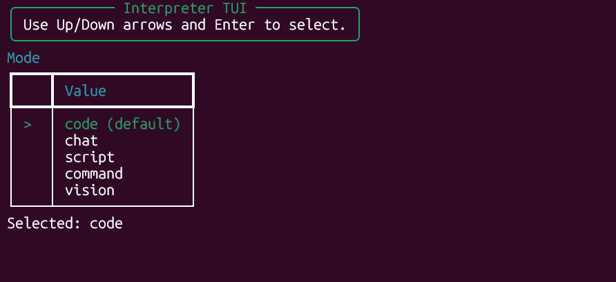
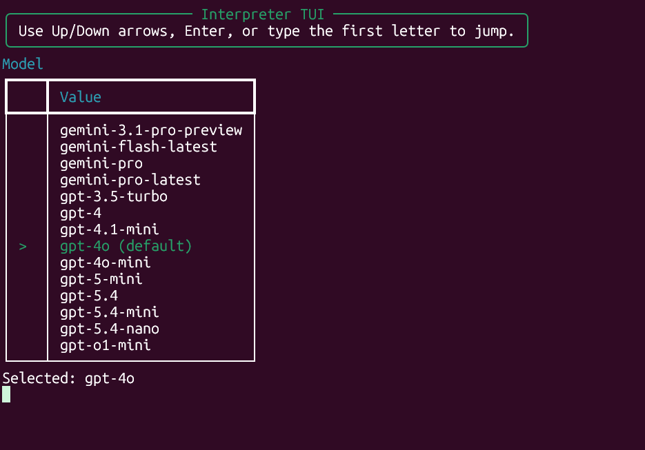
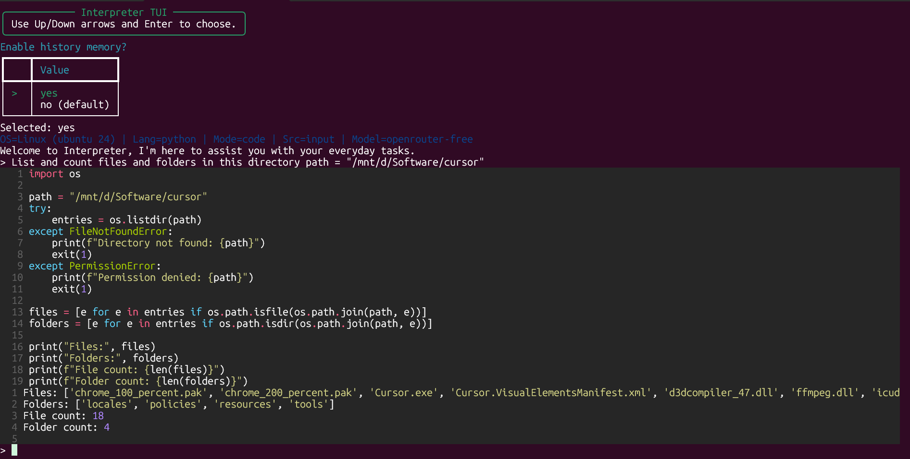

### **Hosting and Spaces:**
[](https://colab.research.google.com/drive/1jGg-NavH8t4W2UVs8MyVMv8bs49qggfA?usp=sharing)
[](https://replit.com/@HaseebMir/open-code-interpreter)
[](https://pypi.org/project/open-code-interpreter/)
[](https://github.com/haseeb-heaven/Open-Code-Interpreter/actions/workflows/python-app.yml)

### **Support Project:**
<a href="https://www.buymeacoffee.com/haseebheaven">
    
</a>
<a href="https://ko-fi.com/heavenhm">
    
</a>

**Welcome to Code-Interpreter 🎉,** an open-source tool that transforms natural language instructions into executable code using **OpenAI**, **Gemini**, **Groq**, **Claude**, **DeepSeek**, **NVIDIA**, **Z AI**, **Browser Use**, and **HuggingFace** models. It executes code safely and supports vision models for image processing.

Supports tasks like file operations, image editing, video processing, data analysis, and more. Works on Windows, MacOS, and Linux.

## **Why Unique?**

Committed to being **free** and **simple** - no downloads or tedious setups required. Works on Windows, Linux, macOS.

## **Future Plans**
- More free-tier Hugging Face models
- Enhanced multi-modal support
- Additional OS support

## **Table of Contents**
- [Features](#features)
- [Installation](#installation)
- [Usage](#usage)
- [Examples](#examples)
- [TUI Screenshots](#tui-screenshots)
- [Settings](#settings)
- [Contributing](#contributing)
- [Versioning](#versioning)
- [Changelog](CHANGELOG.md)
- [License](#license)
- [Acknowledgments](#acknowledgments)

## 📥 **Installation**

## Installtion with Python package manager.
To install Code-Interpreter, run the following command:</br>

```bash
pip install open-code-interpreter
```
- To run the interpreter with Python:</br>
```bash
interpreter -m 'gpt-4o' -md 'code' -dc
```
- Make sure you install required packages before running the interpreter.</br>
- And you have API keys setup in the `.env` file.</br>

## Installtion with Git
To get started with Code-Interpreter, follow these steps:</br>

1. Clone the repository:</br>
```git
git clone https://github.com/haseeb-heaven/code-interpreter.git
cd code-interpreter
```
2. Install the required packages:</br>
```bash
pip install -r requirements.txt
```
3. Setup the Keys required.
4. Copy the example environment file and add the keys you plan to use:</br>
```bash
copy .env.example .env
```

## API Key setup for All models.

Follow the steps below to obtain and set up the API keys for each service:

1. **Obtain the API keys:**
    - HuggingFace: Visit [HuggingFace Tokens](https://huggingface.co/settings/tokens) and get your Access Token.
    - Google Gemini: Visit [Google AI Studio](https://makersuite.google.com/app/apikey) and click on the **Create API Key** button.
    - OpenAI: Visit [OpenAI Dashboard](https://platform.openai.com/account/api-keys), sign up or log in, navigate to the API section in your account dashboard, and click on the **Create New Key** button.
    - Groq AI: Obtain access [here](https://wow.groq.com), then visit [Groq AI Console](https://console.groq.com/keys), sign up or log in, navigate to the API section in your account, and click on the **Create API Key** button.
    - Anthropic AI: Obtain access [here](https://www.anthropic.com/earlyaccess), then visit [Anthropic AI Console](https://console.anthropic.com/settings/keys), sign up or log in, navigate to the API Keys section in your account, and click on the **Create Key** button.
    - NVIDIA API Catalog: Visit [NVIDIA Build](https://build.nvidia.com/), create a key, and use `NVIDIA_API_KEY`.
    - Z AI: Visit [Z AI Docs](https://docs.z.ai/) and use `Z_AI_API_KEY`.
    - OpenRouter: Visit [OpenRouter Keys](https://openrouter.ai/settings/keys) and use `OPENROUTER_API_KEY`.
    - Browser Use: Visit [Browser Use Docs](https://docs.browser-use.com/) and use `BROWSER_USE_API_KEY`.

2. **Save the API keys:**
    - Create a `.env` file in your project root directory.
    - Open the `.env` file and add the following lines, replacing `Your API Key` with the respective keys:

```bash
export HUGGINGFACE_API_KEY="Your HuggingFace API Key"
export GEMINI_API_KEY="Your Google Gemini API Key"
export OPENAI_API_KEY="Your OpenAI API Key"
export GROQ_API_KEY="Your Groq API Key"
export ANTHROPIC_API_KEY="Your Anthropic API Key"
export DEEPSEEK_API_KEY="Your Deepseek API Key"
export NVIDIA_API_KEY="Your NVIDIA API Key"
export Z_AI_API_KEY="Your Z AI API Key"
export OPENROUTER_API_KEY="Your OpenRouter API Key"
export BROWSER_USE_API_KEY="Your Browser Use API Key"
```

# Offline models setup.</br>
This Interpreter supports offline models via **LM Studio** and **OLlaMa** so to download it from [LM-Studio](https://lmstudio.ai/) and [Ollama](https://ollama.com/) follow the steps below.
- Download any model from **LM Studio** like _Phi-2,Code-Llama,Mistral_.
- Then in the app go to **Local Server** option and select the model.
- Start the server and copy the **URL**. (LM-Studio will provide you with the URL).
- Run command `ollama serve` and copy the **URL**. (OLlaMa will provide you with the URL).
- Open config file `configs/local-model.config` and paste the **URL** in the `api_base` field.
- Now you can use the model with the interpreter set the model name to `local-model` and run the interpreter.</br>

4. Run the interpreter with Python:</br>
### Running with Python.
```bash
python interpreter.py -md 'code' -m 'gpt-4o' -dc 
```

5. Run the interpreter directly:</br>
### Running Interpreter without Python (Executable macOS/Linux only).
```bash
./interpreter -md 'code' -m 'gpt-4o' -dc 
```

## 🌟 **Features**

- 🚀 Executes generated code from instructions
- 💾 Saves and edits code with advanced editor
- 📡 Supports offline models via LM Studio
- 📜 Command history and mode selection
- 🧠 Multiple models and languages (Python/JavaScript)
- 👀 Code review before execution
- 🛡️ Safe sandbox execution with timeout and security
- 🧠 Self-repair for failed executions
- 💻 Cross-platform (Windows/macOS/Linux)
- 🤝 Integrates with HuggingFace, OpenAI, Gemini, etc.
- 🎯 Versatile tasks: file ops, image/video editing, data analysis

## 🛠️ **Usage**

To use Code-Interpreter, use the following command options:

- List of all **programming languages** are: </br>
    - `python` - Python programming language.
    - `javascript` - JavaScript programming language.

- List of all **modes** are: </br>
    - `code` - Generates code from your instructions.
    - `script` - Generates shell scripts from your instructions.
    - `command` - Generates single line commands from your instructions.
    -  `vision` - Generates description of image or video.
    - `chat` - Chat with your files and data.

- See [Models.MD](Models.MD) for the complete list of supported models.

- Basic usage (with least options)</br>
```python
python interpreter.py
```
- `python interpreter.py` now opens the TUI and uses arrow-key navigation in a real terminal.
- The TUI falls back to plain text prompts when stdin is piped or not attached to a terminal.
- In `--tui` sessions, `/mode`, `/model`, `/language`, and `/settings` can reopen interactive selectors from inside the live chat interface.

- Launch the classic prompt-based CLI directly</br>
```python
python interpreter.py --cli -m 'z-ai-glm-5' -md 'code'
```
- `python interpreter.py --cli` automatically picks the best configured model from your `.env` file if you do not pass `-m`.
- Safe sandbox protections are enabled by default in `v3.1.0`.
- Use `--unsafe` only when you explicitly want to bypass the execution safety policy.
- LLM request retries are bounded to a maximum of `3` transient retry attempts before the final error is shown.

- Launch the selector-based TUI</br>
```python
python interpreter.py --tui
```

- Using different models (replace 'model-name' with your chosen model) </br>
```python
python interpreter.py --cli -md 'code' -m 'model-name' -dc
```

- Using different modes (replace 'mode-name' with your chosen mode) </br>
```python
python interpreter.py --cli -m 'model-name' -md 'mode-name'
```

- Using auto execution </br>
```python
python interpreter.py -m 'wizard-coder' -md 'code' -dc -e
```

- Saving the code </br>
```python
python interpreter.py -m 'code-llama' -md 'code' -s
```

- Selecting a language (replace 'language-name' with your chosen language) </br>
```python
python interpreter.py -m 'gemini-pro' -md 'code' -s -l 'language-name'
```

- Switching to File mode for prompt input (Here providing filename is optional) </br>
```python
python interpreter.py -m 'gemini-pro' -md 'code' --file 'my_prompt_file.txt'
```

- Using Upgrade interpreter </br>
```python
python interpreter.py --upgrade
```

- Live CLI smoke validation (stable models only) </br>
```bash
python scripts/validate_models_cli.py --providers gemini,groq --tier stable --mode chat
python scripts/validate_models_cli.py --providers openai,anthropic,deepseek,huggingface --tier stable --mode chat
python scripts/validate_models_cli.py --providers nvidia,z-ai,browser-use,openrouter --tier stable --mode chat
```

- Direct provider examples </br>
```bash
python interpreter.py -m 'nvidia-nemotron' -md 'chat' -dc
python interpreter.py -m 'z-ai-glm-5' -md 'chat' -dc
python interpreter.py -m 'openrouter-free' -md 'chat' -dc
python interpreter.py -m 'openrouter-qwen3-coder' -md 'chat' -dc
python interpreter.py -m 'browser-use-bu-max' -md 'chat' -dc
```

Last verified model baseline: **April 5, 2026**.

## 🖼️ **TUI Screenshots**

The new TUI flow is designed for fast keyboard-first setup. Run `python interpreter.py` or `python interpreter.py --tui` to launch the selector UI, then use the arrow keys to choose the mode, model, language, and runtime options.

### Mode selection
Choose between `code`, `chat`, `script`, `command`, and `vision` before the session starts.



### Model selection
Pick your provider and model directly from the terminal without typing long aliases manually.



### Live output
After entering the session, generated code and execution output remain inside the terminal flow with the same safer runtime behavior used by the CLI.



# Interpreter Commands 🖥️

Here are the available commands:

- 📝 `/save` - Save the last code generated.
- ✏️ `/edit` - Edit the last code generated.
- ▶️ `/execute` - Execute the last code generated.
- 🔄 `/mode` - Change the mode of interpreter.
- 🔄 `/model` - Change the model of interpreter.
- 📦 `/install` - Install a package from npm or pip.
- 🌐 `/language` - Change the language of the interpreter.
- 🧹 `/clear` - Clear the screen.
- 🆘 `/help` - Display this help message.
- 🚪 `/list` - List all the _models/modes/language_ available.
- 📝 `/version` - Display the version of the interpreter.
- 🚪 `/exit` - Exit the interpreter.
- 🐞 `/fix` - Fix the generated code for errors.
- ⚙️ `/settings` - Open interactive TUI settings when running with `--tui`.
- 📜 `/log` - Toggle different modes of logging.
- ⏫ `/upgrade` - Upgrade the interpreter.
- 📁 `/prompt` - Switch the prompt mode _File or Input_ modes.
- 💻 `/shell` - Access the shell.
- 🐞 `/debug` - Toggle Debug mode for debugging.


## ⚙️ **Settings**
You can customize the settings of the current model from the `.config` file. It contains all the necessary parameters such as `temperature`, `max_tokens`, and more.

### **Steps to add your own custom API Server**
To integrate your own API server for OpenAI instead of the default server, follow these steps:
1. Navigate to the `Configs` directory.
2. Open the configuration file for the model you want to modify. This could be either `gpt-3.5-turbo.config` or `gpt-4.config`.
3. Add the following line at the end of the file:
   ```
   api_base = https://my-custom-base.com
   ```
   Replace `https://my-custom-base.com` with the URL of your custom API server.
4. Save and close the file.
Now, whenever you select the `gpt-3.5-turbo` or `gpt-4` model, the system will automatically use your custom server.

## **Steps to add new models**

### **Manual Method**
1. 📋 Copy the `.config` file and rename it to `configs/hf-model-new.config`.
2. 🛠️ Modify the parameters of the model like `start_sep`, `end_sep`, `skip_first_line`.
3. 📝 Set the model name from Hugging Face to `HF_MODEL = 'Model name here'`.
4. 🚀 Now, you can use it like this: `python interpreter.py -m 'hf-model-new' -md 'code' -e`.
5. 📁 Make sure the `-m 'hf-model-new'` matches the config file inside the `configs` folder.

### **Automatic Method**
1. 🚀 Go to the `scripts` directory and run the `config_builder` script .
2. 🔧 For Linux/MacOS, run `config_builder.sh` and for Windows, run `config_builder.bat` .
3. 📝 Follow the instructions and enter the model name and parameters.
4. 📋 The script will automatically create the `.config` file for you.

## Star History

<a href="https://star-history.com/#haseeb-heaven/open-code-interpreter&Date">
  <picture>
    <source media="(prefers-color-scheme: dark)" srcset="https://api.star-history.com/svg?repos=haseeb-heaven/open-code-interpreter&type=Date&theme=dark" />
    <source media="(prefers-color-scheme: light)" srcset="https://api.star-history.com/svg?repos=haseeb-heaven/open-code-interpreter&type=Date" />
    
  </picture>
</a>

## 🤝 **Contributing**

If you're interested in contributing to **Code-Interpreter**, we'd love to have you! Please fork the repository and submit a pull request. We welcome all contributions and are always eager to hear your feedback and suggestions for improvements.

## 📌 **Versioning**

Current version: **3.1.0**

Quick highlights:
- **v3.1.0** - Added OpenRouter free-model aliases, made `openrouter/free` the default OpenRouter selection, improved simple-task code generation, added fresh TUI screenshots, and prepared release packaging assets.
- **v3.0.0** - Added a default execution safety sandbox, dangerous command/code circuit breaker, bounded ReACT-style repair retries after failures, clearer execution feedback, and polished CLI/TUI runtime output.
- **v2.4.1** - Added NVIDIA, Z AI, Browser Use, `.env.example`, and `--cli` / `--tui` startup flows.
- **v2.4.0** - 2026 model refresh across OpenAI, Gemini, Anthropic, Groq, and DeepSeek.

Full release history: [CHANGELOG.md](CHANGELOG.md)

---

## 📜 **License**

This project is licensed under the **MIT License**. For more details, please refer to the LICENSE file.

Please note the following additional licensing details:

- The **GPT 3.5/4 models** are provided by **OpenAI** and are governed by their own licensing terms. Please ensure you have read and agreed to their terms before using these models. More information can be found at [OpenAI's Terms of Use](https://openai.com/policies/terms-of-use).

- The **Hugging Face models** are provided by **Hugging Face Inc.** and are governed by their own licensing terms. Please ensure you have read and agreed to their terms before using these models. More information can be found at [Hugging Face's Terms of Service](https://huggingface.co/terms-of-service).

- The **Anthropic AI models** are provided by **Anthropic AI** and are governed by their own licensing terms. Please ensure you have read and agreed to their terms before using these models. More information can be found at [Anthropic AI's Terms of Service](https://www.anthropic.com/terms).

## 🙏 **Acknowledgments**

- We would like to express our gratitude to **HuggingFace**,**Google**,**META**,**OpenAI**,**GroqAI**,**AnthropicAI** for providing the models.
- A special shout-out to the open-source community. Your continuous support and contributions are invaluable to us.

## **📝 Author**
This project is created and maintained by [Haseeb-Heaven](www.github.com/haseeb-heaven).
