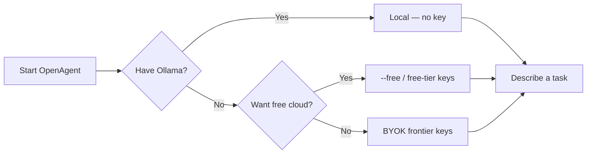

# Quickstart

Get from zero to a working OpenAgent session in a few minutes.

---

## What you'll need

| Requirement         | Notes                                                             |
| ------------------- | ----------------------------------------------------------------- |
| **Node.js 22+**     | Required for the CLI packages                                     |
| **A model backend** | One of: Ollama (local), a free-tier API key, or any BYOK provider |
| **Terminal**        | Bash, Zsh, or PowerShell                                          |

No Google account is required. Local models need no API key at all.

---

## 1. Install

### From source (recommended while developing)

```bash
git clone https://github.com/haseeb-heaven/open-agent.git
cd open-agent
npm install
npm run build
npm start
```

### Global npm package

```bash
npm install -g open-agent
openagent
```

More options: [Installation](./installation.mdx).

---

## 2. Pick how you want to run models



### Option A — Local (privacy-first)

```bash
# Terminal 1
ollama serve
ollama pull llama3.1:8b

# Terminal 2
npm start
# or: openagent -m ollama/llama3.1:8b
```

Details: [Local models](./local-models.md).

### Option B — Free / cheap cloud

```bash
# See free catalog entries
npm start -- --models

# Prefer free rotation with automatic fallback
npm start -- --free "explain the project structure"
```

Interactive key setup:

```bash
npm start -- --byok
```

Details: [Free models](./free-models.md) · [Providers](./providers.md).

### Option C — Bring your own key (frontier)

Set one env var per provider (in `.env` or the shell), for example:

```bash
# .env at repo root
OPENAI_API_KEY=sk-...
ANTHROPIC_API_KEY=sk-ant-...
GEMINI_API_KEY=...
GROQ_API_KEY=...
```

```bash
npm start -- -m gpt-4o
npm start -- --provider anthropic -m claude-sonnet-4-6
```

Details: [Authentication & providers](./authentication.mdx).

---

## 3. Your first task

In the interactive UI:

```text
summarize the README and list the main packages
```

Or one-shot headless:

```bash
npm start -- --free -p "list the 5 largest files in this project"
```

### Main UI


| Area       | What you see                                       |
| ---------- | -------------------------------------------------- |
| **Header** | **OA** logo, version, auth / provider status       |
| **Status** | Approval mode, tips, context / MCP / skills counts |
| **Prompt** | Natural language or `@path/to/file`                |
| **Footer** | Workspace, git branch, model, memory               |

---

## 4. Everyday commands

### CLI

| Command                   | Purpose                      |
| ------------------------- | ---------------------------- |
| `openagent` / `npm start` | Interactive session          |
| `openagent --free "…"`    | Prefer free models           |
| `openagent -m <model>`    | Pin a model                  |
| `openagent --models`      | List models by provider      |
| `openagent --byok`        | Save provider keys to `.env` |
| `openagent -p "…"`        | Non-interactive prompt       |
| `openagent -r latest`     | Resume last session          |

### In-session

| Command              | Purpose                      |
| -------------------- | ---------------------------- |
| `/models`            | Open the model picker        |
| `/models set <name>` | Switch model immediately     |
| `/byok`              | List key status / save a key |
| `/tools`             | List active tools            |
| `/help`              | Full command list            |
| `/quit`              | Exit                         |

Full list: [CLI cheatsheet](../cli/cli-reference.md).

---

## 5. Give the agent project context

- Type `@src/path/to/file.ts` to attach file content (text files work best).
- Keep project instructions in context files (see
  [Project context](../cli/openagent-md.md)).
- For binary formats (`.docx`, images as binary, etc.), convert to text first —
  see [Common errors](../resources/common-errors.md).

---

## Next steps

| Next                          | Link                                                            |
| ----------------------------- | --------------------------------------------------------------- |
| All providers & env vars      | [Provider catalog](./providers.md)                              |
| Free model tips & rate limits | [Free models](./free-models.md)                                 |
| Tools & file workflows        | [File management tutorial](../cli/tutorials/file-management.md) |
| Sandbox & safety              | [Sandboxing](../cli/sandbox.md)                                 |
| Something failed              | [Common errors](../resources/common-errors.md)                  |
